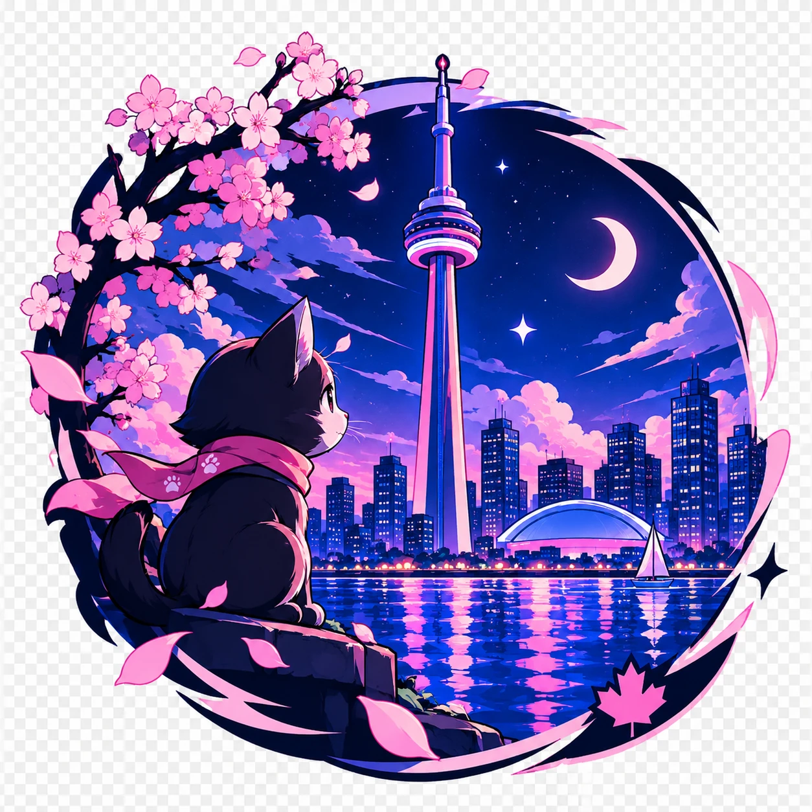

<p align="center">
  
</p>

# CN Tower (C)

Порт текстового квеста [CN-Tower](https://github.com/cherrywheel/CN-Tower) с Python на C.

## Скачать

Готовые сборки для Windows и Linux лежат в [Releases](../../releases).
Релиз собирается автоматически после каждого пуша в `main`.

## Сборка

Windows (Developer Command Prompt для MSVC):

```
cd src
nmake
cn_tower_game.exe
```

Linux / macOS:

```
cd src
make
./cn_tower_game
```

Если игра запущена из `src`, сохранения и возраст пишутся в `../data/`,
иначе — в папку, из которой её запустили.

## Интерфейс

В терминале игра открывается в полноэкранном режиме:

* сверху — локация, деньги и предметы;
* в середине — текст игры;
* внизу — подсказки: действия, доступные прямо сейчас, и общие команды.

Клавиши:

* `Tab` — дополнить команду, повторные нажатия перебирают варианты;
* `→` — принять серую подсказку;
* `↑` / `↓` — история команд;
* `Ctrl+U` — стереть строку, `Ctrl+D` / `Ctrl+C` — выйти.

Обычный построчный режим: `cn_tower_game --plain` или переменная окружения
`CN_TOWER_PLAIN=1`. Он же включается сам, если вывод идёт не в терминал.

## Как играть

Вводишь команды вроде `Go North`, `Buy Ticket`, `Look Around` (регистр не важен).

* `Help` — список команд, `Look` — ещё раз показать, где ты.
* `Inventory` — деньги и предметы.
* `Save` / `Load` — сохранить и загрузить игру.
* `Restart` — начать заново, `Exit` — выйти.
* `Debug` — меню отладки (деньги, предметы, телепорт, режим Sweet+).

Есть одна хорошая концовка (EdgeWalk) и несколько плохих.

## Отличия от Python-версии

* Нет определения страны по IP: режим Sweet+ просто включается в меню отладки.
* Реплики и ASCII-арт вшиты в программу, интернет не нужен.
* Добавлены ходы, без которых EdgeWalk был недостижим: Just a Chill Guy
  находится к востоку от стеклянного пола, найденный телефон можно вернуть
  в справочной (`Return Phone`) за награду $100, со смотровой площадки можно
  спуститься на лифте (`Go Back`), а Алекса можно встретить второй раз.

## Картинки

В `assets/`:

* `cover.webp` — обложка README;
* `icon.webp`, `cn_tower.ico` — иконка, `.ico` вшивается в `cn_tower_game.exe`;
* `sticker.webp`, `icon-flat.png` — запасные варианты;
* `social-preview.png` — превью репозитория 1280×640, загружается вручную:
  Settings → General → Social preview.

