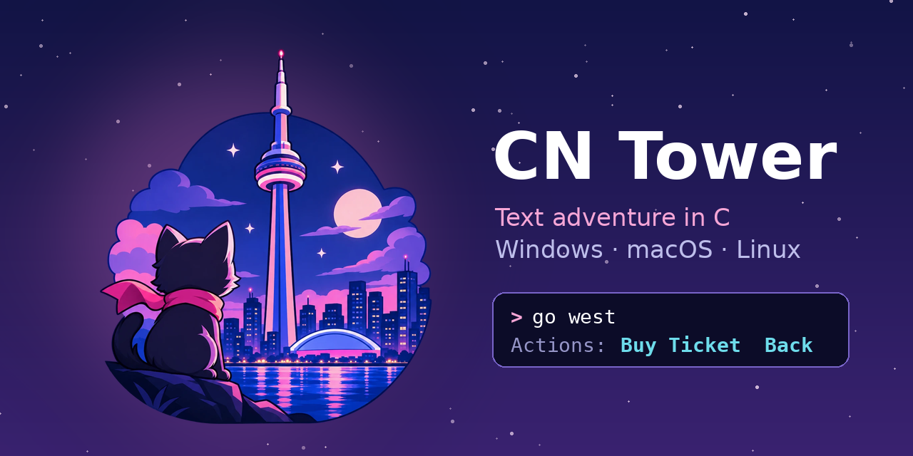

<p align="center">
  
</p>

# cn tower

a text adventure about climbing torontos cn tower and doing the edgewalk

rewritten in c from the [python original](https://github.com/cherrywheel/CN-Tower)

no dependencies no internet just one binary

## download

grab a build from [releases](../../releases)

every push to `main` ships a new one

every file is the game itself no archives no installers

### windows

| arch | file |
|---|---|
| x64 | `cn_tower_game-windows-x64.exe` |
| x86 | `cn_tower_game-windows-x86.exe` |
| arm64 | `cn_tower_game-windows-arm64.exe` |

### macos

one universal file for apple silicon and intel on macos 11+

`cn_tower_game-macos-universal`

### linux

static so any distro works

`cn_tower_game-linux-<arch>` where arch is one of

| arch | what runs it |
|---|---|
| `x86_64` | your pc |
| `i686` | your old pc |
| `aarch64` | raspberry pi 4 and 5 arm servers baikal-m |
| `armhf` | raspberry pi 2 and 3 on 32 bit |
| `armel` | raspberry pi 1 and zero and old routers |
| `riscv64` | risc-v boards |
| `loongarch64` | loongson |
| `mipsel` | baikal-t1 and routers |
| `mips` | big endian routers |
| `mips64el` `mips64` | 64 bit mips |
| `ppc64le` | ibm power |
| `ppc64` `powerpc` | old power macs and big endian power |
| `s390x` | ibm mainframes |
| `sparc64` | sun and oracle sparc |
| `e2k` | elbrus 2c3 12c and 16c |
| `alpha` `hppa` `m68k` `sh4` | museum pieces |

### bsd and friends

`cn_tower_game-<os>-x86_64` for `freebsd` `openbsd` `netbsd` `dragonflybsd` `solaris` `illumos` `haiku`

### openwrt

real packages for your router built with the official openwrt sdk

`cn-tower-openwrt-<version>-<arch>` where version is `24.10` (ipk) or `25.12` (apk)

| arch | routers |
|---|---|
| `mips_24kc` | ath79 like most old tp-links |
| `mipsel_24kc` | ramips like mt7621 ones |
| `aarch64_cortex-a53` | mediatek filogic and mt7622 |
| `aarch64_generic` | arm64 boxes |
| `arm_cortex-a7_neon-vfpv4` | ipq40xx |
| `arm_cortex-a9_vfpv3-d16` | mvebu like the wrt ones |
| `x86_64` | pc and vm installs |

no idea which arch you have

```
grep ARCH /etc/openwrt_release
```

on 24.10

```
opkg install cn-tower-openwrt-24.10-mips_24kc.ipk
cn-tower
```

on 25.12

```
apk add --allow-untrusted cn-tower-openwrt-25.12-mips_24kc.apk
cn-tower
```

ci installs it for real in an openwrt rootfs for x86_64 mips_24kc aarch64_generic and arm_cortex-a9 and plays through to the win

the rest only get built since theres no rootfs image for them

to build it in your own sdk add the `openwrt` dir as a feed

```
echo "src-link cntower /path/to/CN-Tower-C/openwrt" >> feeds.conf
./scripts/feeds update cntower
./scripts/feeds install cn-tower
make package/cn-tower/compile
```

### webassembly

`cn_tower_game-wasm32-wasi.wasm` runs anywhere with a wasi runtime

```
wasmtime cn_tower_game-wasm32-wasi.wasm
```

no terminal in wasi so it always plays in plain mode

to keep saves give it the current dir

```
wasmtime --dir=. cn_tower_game-wasm32-wasi.wasm
```

### how its tested

ci plays every build except windows on arm and a few openwrt ones through to the win

linux ones run under qemu and bsd solaris and haiku ones run in real vms

### why every arch

a text adventure doesnt need a gpu or a fast cpu or even a real screen so theres no excuse for it not to run everywhere

its plain c99 with zero dependencies so it doubles as a tiny canary for your setup

if it wins the game then your compiler your libc your emulator and your weird box all work

dig out whatever you have lying around an old router a raspberry pi a sparc from the closet an elbrus or a fresh loongson and play it

porting a compiler or bringing up an emulator

this is a small real program with a known good ending so use it to check your work

### windows on arm

idgaf about windows on arm

the build exists because it was one line in ci

ci never even runs it so if it breaks thats your problem

### running on unix

browsers drop the executable bit so give it back

```
chmod +x cn_tower_game-linux-x86_64
./cn_tower_game-linux-x86_64
```

the macos build isnt signed so also clear the quarantine flag

```
chmod +x cn_tower_game-macos-universal
xattr -d com.apple.quarantine cn_tower_game-macos-universal
./cn_tower_game-macos-universal
```

## build

the easy way is one script that finds or installs a c compiler builds the game and plays through to the win to prove it works

anything unix like including linux macos bsd solaris haiku termux wsl and msys2

```
sh setup.sh
```

windows

```
setup.cmd
```

it asks before installing anything and `--yes` skips the questions

it knows apt dnf yum pacman zypper apk xbps emerge eopkg swupd nix brew pkg pkg_add pkgin pkgman and winget

on debian or ubuntu `sh setup.sh --cross` also installs every cross compiler and qemu that ci uses and plays through to the win on all 20 linux archs right on your machine

loongarch64 needs zig for that so `pip install ziglang` first and `--out DIR` keeps all the binaries

thats exactly what ci runs for linux

### by hand

windows from a developer command prompt

```
cd src
nmake
```

linux and macos

```
cd src
make
```

plain c99 and posix (winapi on windows)

if it has a c compiler it builds

### elbrus

started purely for fun and now its a real build

ci builds it with mcst `lcc` 1.31.05 and plays through to the win under `qemu-e2k`

the build targets e2k v6 so its elbrus 2c3 12c and 16c

the toolchain lives in a private prerelease of this repo so forks wont get this build

on the real thing

```
cd src
make CC=lcc
```

## play

type commands like `go north` `buy ticket` `look around`

case doesnt matter

| command | what it does |
|---|---|
| `help` | list commands |
| `look` | describe where you are again |
| `inventory` | money and items |
| `save` / `load` | save and load the game |
| `restart` / `exit` | start over or quit |
| `debug` | money items teleport and sweet+ mode |

one good ending and a bunch of bad ones

run from `src` and saves go to `../data/`

run from anywhere else and they go to the current directory

## interface

in a terminal the game goes full screen

location money and items up top

the story in the middle

hints at the bottom showing only what works right now plus the general commands

| key | action |
|---|---|
| `tab` | complete a command and press again to cycle |
| `→` | accept the grey suggestion |
| `↑` `↓` | command history |
| `ctrl+u` | clear the line |
| `ctrl+d` `ctrl+c` | quit |

`--plain` or `CN_TOWER_PLAIN=1` gives you the classic line by line mode

it also kicks in on its own when output isnt a terminal

## changes from the python version

- no ip based country check and sweet+ mode lives in the debug menu
- dialogue and ascii art are built in
- the edgewalk is actually winnable now
  - just a chill guy is east of the glass floor
  - alexs phone can be returned at the info booth for $100 with `return phone`
  - the lookout has an elevator back down with `go back`
  - alex can be met a second time

## art

`assets/` holds the artwork

`social-preview.png` is this readme header and the repo preview

`cn_tower.ico` gets embedded into the windows exe

the rest are alternatives

the repo preview is set by hand in settings → general → social preview
